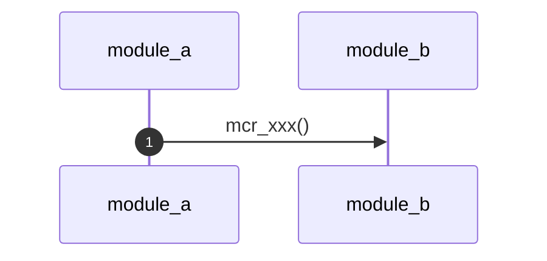
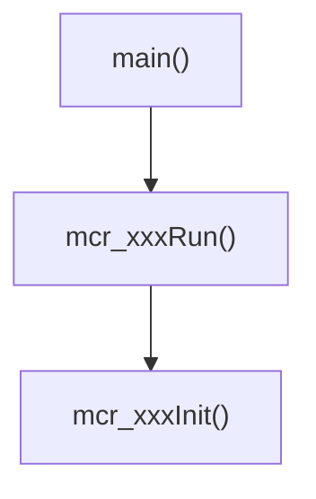

# {{프로젝트명}} Call Flow

> **코딩 스타일**: [[CODING_STYLE]]

> **요약**: (한 줄 — 이 기능이 무엇을 하는지)

> Obsidian: Settings → Core plugins → **Mermaid** 활성화

---

## 모듈 일람

| 파일 | 주요 함수 | 역할 |
|------|-----------|------|
| | | |

---

## 전체 시퀀스



---

## 함수 Call Flow



---

## Wire Format (해당 시)

```mermaid
block-beta
    columns 2
    block:packet:2
        h["header"]
        b["body"]
```

---

## 변경 이력

| 날짜 | 내용 |
|------|------|
| | 초안 |
